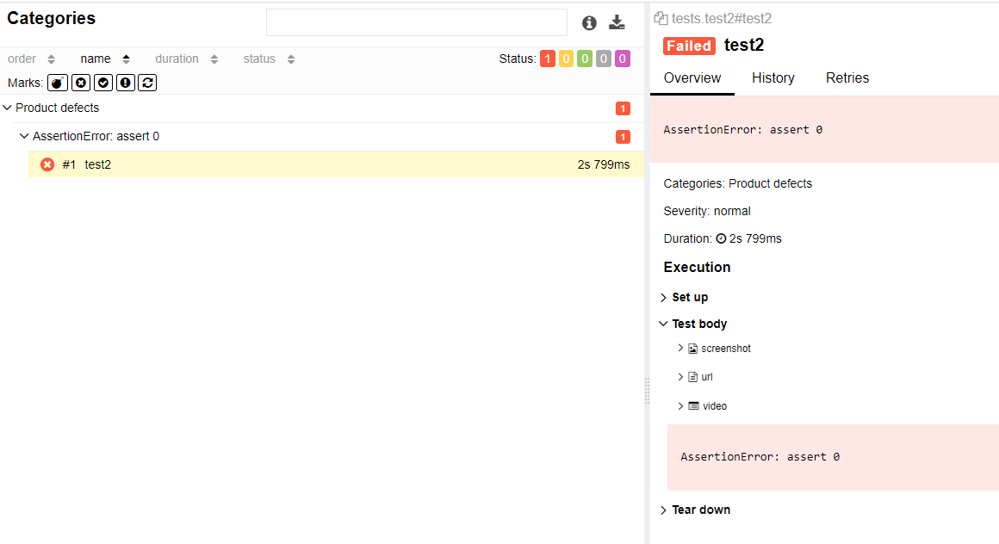
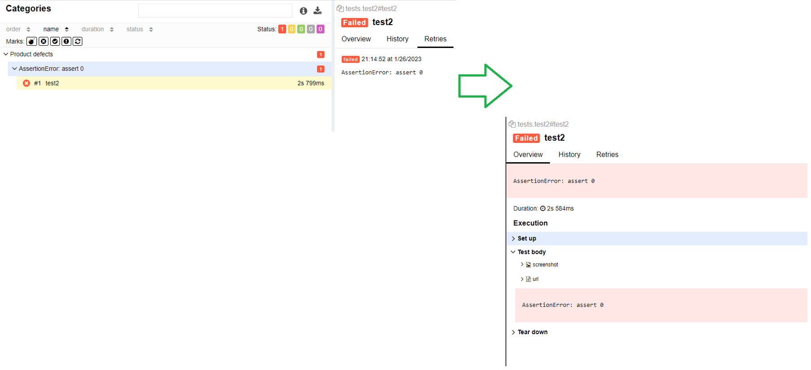

Do here the same stuff (almost).
Difference is, how we handle reruns. See corresponding functions under example2/tests/conftest module
Run tests like this:

cd example2

`pytest --reruns=1 -v --tb=short --alluredir=results tests/test2.py
`

where:
1.     -v: rich output
2.     --tb=short: traceback is not too long
3.     --alluredir=result: folder to store results

Once tests are executed run allure serve results command to see the results in the browser
- passed test does not contain screenshot
- but failed does; it's done automatically in **pytest_exception_interact** due to invoking make_attachment function in the

Second run out of 2

First run out of 2
